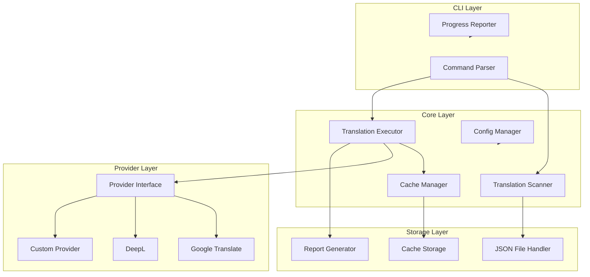

# Design Document: Auto Translation Tool

## Overview

Auto Translation Tool 是一个通用的 Node.js 命令行工具，用于自动化 i18n 翻译流程。该工具采用模块化架构设计，支持多种翻译服务提供商，可轻松集成到现有项目中。

核心设计原则：
- **可扩展性**: 通过 Provider 接口支持多种翻译服务
- **可复用性**: 作为独立 npm 包，可在多个项目中使用
- **可靠性**: 完善的缓存、重试和错误处理机制
- **易用性**: 简洁的 CLI 接口和配置文件

## Architecture



## Components and Interfaces

### 1. Translation Provider Interface

```typescript
/**
 * 翻译服务提供商接口
 * 所有翻译服务必须实现此接口
 */
interface TranslationProvider {
  /** 提供商名称 */
  name: string;
  
  /**
   * 翻译单个文本
   * @param text 源文本
   * @param sourceLang 源语言代码 (e.g., 'en')
   * @param targetLang 目标语言代码 (e.g., 'zh')
   * @returns 翻译后的文本
   */
  translate(text: string, sourceLang: string, targetLang: string): Promise<string>;
  
  /**
   * 批量翻译多个文本
   * @param texts 源文本数组
   * @param sourceLang 源语言代码
   * @param targetLang 目标语言代码
   * @returns 翻译后的文本数组
   */
  translateBatch(texts: string[], sourceLang: string, targetLang: string): Promise<string[]>;
  
  /**
   * 检查提供商是否可用（API密钥有效等）
   */
  isAvailable(): Promise<boolean>;
}
```

### 2. Google Translate Provider

```typescript
/**
 * Google Translate API 实现
 * 使用 @google-cloud/translate 或免费的 google-translate-api
 */
class GoogleTranslateProvider implements TranslationProvider {
  name = 'google';
  private apiKey: string;
  
  constructor(config: { apiKey?: string; useFreeApi?: boolean });
  
  async translate(text: string, sourceLang: string, targetLang: string): Promise<string>;
  async translateBatch(texts: string[], sourceLang: string, targetLang: string): Promise<string[]>;
  async isAvailable(): Promise<boolean>;
}
```

### 3. DeepL Provider

```typescript
/**
 * DeepL API 实现
 */
class DeepLProvider implements TranslationProvider {
  name = 'deepl';
  private apiKey: string;
  private apiUrl: string; // Free or Pro API endpoint
  
  constructor(config: { apiKey: string; useFreeApi?: boolean });
  
  async translate(text: string, sourceLang: string, targetLang: string): Promise<string>;
  async translateBatch(texts: string[], sourceLang: string, targetLang: string): Promise<string[]>;
  async isAvailable(): Promise<boolean>;
}
```

### 4. Translation Scanner

```typescript
/**
 * 翻译扫描器 - 检测缺失的翻译
 */
class TranslationScanner {
  /**
   * 扫描目标语言文件，找出缺失的翻译
   * @param sourceFile 源语言文件路径
   * @param targetFile 目标语言文件路径
   * @returns 缺失翻译的列表
   */
  scan(sourceFile: string, targetFile: string): Promise<MissingTranslation[]>;
  
  /**
   * 扫描所有目标语言
   * @param config 配置对象
   * @returns 按语言分组的缺失翻译
   */
  scanAll(config: TranslationConfig): Promise<Map<string, MissingTranslation[]>>;
  
  /**
   * 生成扫描报告
   */
  generateReport(results: Map<string, MissingTranslation[]>): ScanReport;
}

interface MissingTranslation {
  key: string;           // 翻译键路径 (e.g., "calculators.mortgage.title")
  sourceValue: string;   // 源语言值
  targetValue?: string;  // 目标语言当前值（如果存在但未翻译）
  reason: 'missing' | 'untranslated' | 'changed';
}
```

### 5. Translation Executor

```typescript
/**
 * 翻译执行器 - 执行实际的翻译操作
 */
class TranslationExecutor {
  constructor(
    provider: TranslationProvider,
    cache: CacheManager,
    config: ExecutorConfig
  );
  
  /**
   * 翻译单个条目
   */
  translateEntry(entry: MissingTranslation, targetLang: string): Promise<TranslationResult>;
  
  /**
   * 批量翻译
   */
  translateBatch(
    entries: MissingTranslation[],
    targetLang: string,
    options?: BatchOptions
  ): Promise<BatchResult>;
  
  /**
   * 执行翻译并更新文件
   */
  executeAndSave(
    targetFile: string,
    entries: MissingTranslation[],
    targetLang: string
  ): Promise<ExecutionResult>;
}

interface ExecutorConfig {
  rateLimitPerSecond: number;
  batchSize: number;
  retryAttempts: number;
  retryDelay: number;
  preservePlaceholders: boolean;
  preserveHtml: boolean;
}
```

### 6. Cache Manager

```typescript
/**
 * 缓存管理器 - 管理翻译缓存
 */
class CacheManager {
  constructor(config: CacheConfig);
  
  /**
   * 获取缓存的翻译
   */
  get(sourceText: string, targetLang: string): string | null;
  
  /**
   * 存储翻译到缓存
   */
  set(sourceText: string, targetLang: string, translatedText: string): void;
  
  /**
   * 检查缓存是否存在
   */
  has(sourceText: string, targetLang: string): boolean;
  
  /**
   * 清除缓存
   */
  clear(targetLang?: string): void;
  
  /**
   * 保存缓存到文件
   */
  save(): Promise<void>;
  
  /**
   * 从文件加载缓存
   */
  load(): Promise<void>;
}

interface CacheConfig {
  enabled: boolean;
  storageType: 'file' | 'memory';
  filePath?: string;
  maxSize?: number;
}
```

### 7. JSON File Handler

```typescript
/**
 * JSON 文件处理器 - 读写 i18n JSON 文件
 */
class JsonFileHandler {
  /**
   * 读取 JSON 文件并解析为扁平化的键值对
   */
  read(filePath: string): Promise<FlattenedJson>;
  
  /**
   * 将扁平化的键值对写回 JSON 文件，保持原有结构
   */
  write(filePath: string, data: FlattenedJson, preserveStructure?: boolean): Promise<void>;
  
  /**
   * 将嵌套 JSON 扁平化为点分隔的键
   */
  flatten(obj: object, prefix?: string): FlattenedJson;
  
  /**
   * 将扁平化的键值对还原为嵌套结构
   */
  unflatten(data: FlattenedJson): object;
  
  /**
   * 更新特定键的值
   */
  updateKey(filePath: string, key: string, value: string): Promise<void>;
}

type FlattenedJson = Map<string, string>;
```

### 8. Config Manager

```typescript
/**
 * 配置管理器
 */
class ConfigManager {
  /**
   * 加载配置文件
   */
  load(configPath?: string): Promise<TranslationConfig>;
  
  /**
   * 验证配置
   */
  validate(config: TranslationConfig): ValidationResult;
  
  /**
   * 创建默认配置文件
   */
  createDefault(outputPath: string): Promise<void>;
}

interface TranslationConfig {
  // 翻译提供商配置
  provider: {
    type: 'google' | 'deepl' | 'custom';
    apiKey?: string;
    useFreeApi?: boolean;
    customProviderPath?: string;
  };
  
  // 语言配置
  locales: {
    source: string;           // 源语言 (e.g., 'en')
    targets: string[];        // 目标语言列表 (e.g., ['zh', 'es', 'ja'])
  };
  
  // 文件路径配置
  paths: {
    pattern: string;          // 文件路径模式 (e.g., 'js/i18n/{locale}.json')
    output?: string;          // 输出目录（可选）
  };
  
  // 执行配置
  execution: {
    rateLimitPerSecond: number;
    batchSize: number;
    retryAttempts: number;
    dryRun: boolean;
  };
  
  // 缓存配置
  cache: CacheConfig;
  
  // 质量配置
  quality: {
    preservePlaceholders: boolean;
    preserveHtml: boolean;
    reviewMode: boolean;
  };
  
  // 日志配置
  logging: {
    level: 'debug' | 'info' | 'warn' | 'error';
    outputFile?: string;
  };
}
```

### 9. CLI Commands

```typescript
/**
 * CLI 命令定义
 */

// 扫描命令 - 检测缺失的翻译
// i18n-translate scan [--locale <locale>] [--config <path>]
interface ScanCommand {
  locale?: string;    // 指定语言，不指定则扫描所有
  config?: string;    // 配置文件路径
  output?: string;    // 报告输出路径
}

// 翻译命令 - 执行翻译
// i18n-translate translate [--locale <locale>] [--dry-run] [--config <path>]
interface TranslateCommand {
  locale?: string;    // 指定语言，不指定则翻译所有
  dryRun?: boolean;   // 预览模式
  config?: string;    // 配置文件路径
  force?: boolean;    // 强制重新翻译（忽略缓存）
}

// 验证命令 - 验证翻译完整性
// i18n-translate validate [--locale <locale>] [--config <path>]
interface ValidateCommand {
  locale?: string;
  config?: string;
  strict?: boolean;   // 严格模式（任何缺失都报错）
}

// 初始化命令 - 创建配置文件
// i18n-translate init
interface InitCommand {
  force?: boolean;    // 覆盖现有配置
}

// 缓存命令 - 管理缓存
// i18n-translate cache <action> [--locale <locale>]
interface CacheCommand {
  action: 'clear' | 'stats' | 'export';
  locale?: string;
}
```

## Data Models

### Translation Result

```typescript
interface TranslationResult {
  key: string;
  sourceText: string;
  translatedText: string;
  targetLang: string;
  fromCache: boolean;
  timestamp: Date;
}

interface BatchResult {
  successful: TranslationResult[];
  failed: FailedTranslation[];
  skipped: SkippedTranslation[];
  stats: {
    total: number;
    success: number;
    failed: number;
    skipped: number;
    fromCache: number;
    duration: number;
  };
}

interface FailedTranslation {
  key: string;
  sourceText: string;
  error: string;
  attempts: number;
}

interface SkippedTranslation {
  key: string;
  sourceText: string;
  reason: string;
}
```

### Scan Report

```typescript
interface ScanReport {
  timestamp: Date;
  sourceLocale: string;
  results: LocaleReport[];
  summary: {
    totalLocales: number;
    totalMissing: number;
    totalUntranslated: number;
    completionRate: number;
  };
}

interface LocaleReport {
  locale: string;
  filePath: string;
  missing: MissingTranslation[];
  stats: {
    total: number;
    translated: number;
    missing: number;
    untranslated: number;
    completionRate: number;
  };
}
```

### Cache Entry

```typescript
interface CacheEntry {
  sourceText: string;
  targetLang: string;
  translatedText: string;
  provider: string;
  timestamp: Date;
  hash: string;  // MD5 hash of sourceText for quick lookup
}

interface CacheStore {
  version: string;
  entries: Map<string, CacheEntry>;  // key = `${hash}:${targetLang}`
  stats: {
    hits: number;
    misses: number;
    size: number;
  };
}
```


## Correctness Properties

*A property is a characteristic or behavior that should hold true across all valid executions of a system—essentially, a formal statement about what the system should do. Properties serve as the bridge between human-readable specifications and machine-verifiable correctness guarantees.*

### Property 1: JSON Flatten/Unflatten Round Trip

*For any* valid nested JSON object, flattening it to dot-notation keys and then unflattening back should produce an equivalent object.

**Validates: Requirements 1.4**

### Property 2: Missing Translation Detection Completeness

*For any* source JSON and target JSON where target is a subset of source, the scanner should identify exactly the keys that exist in source but not in target, plus keys where values are identical (untranslated).

**Validates: Requirements 1.1, 1.2, 1.3**

### Property 3: Batch Translation Completeness

*For any* set of missing translations submitted for batch translation, the result should account for every entry as either successful, failed, or skipped, with success + failed + skipped = total input count.

**Validates: Requirements 3.1, 3.5**

### Property 4: Cache Prevents Redundant API Calls

*For any* translation request where the source text and target language combination exists in cache, the Translation_Provider should not be called, and the cached value should be returned.

**Validates: Requirements 4.2, 4.3**

### Property 5: Cache Clear Effectiveness

*For any* cache state, after executing the clear command (optionally for a specific language), the cache should contain no entries for the cleared scope.

**Validates: Requirements 4.5**

### Property 6: Placeholder Preservation

*For any* source text containing placeholder patterns (e.g., `{variable}`, `{{variable}}`, `%s`, `%d`), the translated text should contain all the same placeholders.

**Validates: Requirements 7.1, 7.2, 7.3**

### Property 7: HTML Tag Preservation

*For any* source text containing HTML tags, the translated text should preserve the tag structure (opening and closing tags should match).

**Validates: Requirements 7.4**

### Property 8: Retry Behavior on Failure

*For any* translation request that fails, the system should retry exactly the configured number of times (default 3) with exponential backoff before reporting failure.

**Validates: Requirements 2.6**

### Property 9: Rate Limit Compliance

*For any* batch of translation requests, the time between consecutive API calls should be at least the configured rate limit delay.

**Validates: Requirements 3.2**

### Property 10: File Update Correctness

*For any* completed translation, reading the target file after update should return the translated value at the correct key path.

**Validates: Requirements 3.3, 3.4**

### Property 11: Dry Run No Side Effects

*For any* execution with --dry-run flag, no files should be modified and no API calls should be made to the translation provider.

**Validates: Requirements 6.6**

### Property 12: Incremental Detection Accuracy

*For any* source file update, the scanner should correctly categorize each key as: new (exists in source but not in previous scan), changed (value differs from previous scan), or unchanged.

**Validates: Requirements 8.1, 8.2, 8.3, 8.4**

### Property 13: Config Validation Error Messages

*For any* configuration file missing required fields, the validation should return error messages that specifically identify each missing field.

**Validates: Requirements 5.6**

### Property 14: Error Logging Completeness

*For any* error during translation (provider error or file operation error), the log should contain the relevant context (key path for translation errors, file path for file errors) and error details.

**Validates: Requirements 9.1, 9.2**

### Property 15: Batch Error Resilience

*For any* batch translation where some entries fail, all remaining entries should still be processed (the batch should not stop at the first error).

**Validates: Requirements 9.4**

## Error Handling

### Provider Errors

```typescript
class TranslationProviderError extends Error {
  constructor(
    public provider: string,
    public originalError: Error,
    public retryCount: number
  ) {
    super(`Translation provider '${provider}' failed after ${retryCount} retries: ${originalError.message}`);
  }
}
```

**Handling Strategy:**
1. Catch provider-specific errors (rate limit, auth, network)
2. Implement exponential backoff: delay = baseDelay * 2^attemptNumber
3. After max retries, log error and continue with next entry
4. Aggregate all errors for final report

### File Operation Errors

```typescript
class FileOperationError extends Error {
  constructor(
    public operation: 'read' | 'write',
    public filePath: string,
    public originalError: Error
  ) {
    super(`Failed to ${operation} file '${filePath}': ${originalError.message}`);
  }
}
```

**Handling Strategy:**
1. Validate file exists before read
2. Create backup before write
3. Restore backup on write failure
4. Report specific file path in error

### Configuration Errors

```typescript
class ConfigurationError extends Error {
  constructor(
    public missingFields: string[],
    public invalidFields: { field: string; reason: string }[]
  ) {
    super(`Configuration invalid: ${missingFields.length} missing, ${invalidFields.length} invalid`);
  }
}
```

**Handling Strategy:**
1. Validate all required fields before execution
2. Provide clear error messages for each issue
3. Suggest fixes where possible

### Placeholder Validation Errors

```typescript
class PlaceholderMismatchError extends Error {
  constructor(
    public key: string,
    public sourcePlaceholders: string[],
    public translatedPlaceholders: string[]
  ) {
    super(`Placeholder mismatch for key '${key}'`);
  }
}
```

**Handling Strategy:**
1. Extract placeholders from source and translation
2. Compare sets of placeholders
3. Log warning and optionally skip translation
4. Include in report for manual review

## Testing Strategy

### Unit Tests

Unit tests will cover specific examples and edge cases:

1. **JSON Handler Tests**
   - Empty JSON object
   - Deeply nested structures (5+ levels)
   - Special characters in keys and values
   - Unicode content

2. **Scanner Tests**
   - Empty source file
   - Empty target file
   - Identical files (no missing)
   - Completely different files

3. **Cache Tests**
   - Cache hit/miss scenarios
   - Cache persistence (save/load)
   - Cache clear operations

4. **Config Tests**
   - Valid configuration loading
   - Missing required fields
   - Invalid field values

### Property-Based Tests

Property-based tests will use **fast-check** library for TypeScript/JavaScript.

Each property test will:
- Run minimum 100 iterations
- Use smart generators for realistic test data
- Be tagged with the property number from this design document

**Generator Examples:**

```typescript
// Generate nested JSON objects
const nestedJsonArb = fc.letrec(tie => ({
  json: fc.oneof(
    fc.string(),
    fc.dictionary(fc.string(), tie('json'), { maxKeys: 5 })
  )
})).json;

// Generate translation entries with placeholders
const textWithPlaceholdersArb = fc.tuple(
  fc.string(),
  fc.array(fc.string().map(s => `{${s}}`), { maxLength: 3 })
).map(([text, placeholders]) => 
  placeholders.reduce((t, p, i) => `${t} ${p} `, text)
);

// Generate locale codes
const localeArb = fc.constantFrom('en', 'zh', 'es', 'ja', 'de', 'fr', 'ko', 'pt', 'ar', 'hi');
```

**Test Configuration:**

```typescript
// fast-check configuration
const fcConfig = {
  numRuns: 100,
  verbose: true,
  seed: Date.now()
};
```

### Integration Tests

Integration tests will verify end-to-end workflows:

1. **Full Translation Workflow**
   - Scan → Translate → Verify

2. **CLI Command Tests**
   - Each command with various flags

3. **Provider Integration** (with mocks)
   - Google Translate mock
   - DeepL mock
   - Error scenarios

### Test File Structure

```
tests/
├── unit/
│   ├── json-handler.test.ts
│   ├── scanner.test.ts
│   ├── cache.test.ts
│   ├── config.test.ts
│   └── executor.test.ts
├── property/
│   ├── json-roundtrip.property.ts
│   ├── scanner-completeness.property.ts
│   ├── cache-behavior.property.ts
│   ├── placeholder-preservation.property.ts
│   └── batch-completeness.property.ts
├── integration/
│   ├── cli.test.ts
│   ├── workflow.test.ts
│   └── providers.test.ts
└── fixtures/
    ├── sample-en.json
    ├── sample-zh.json
    └── config.json
```
